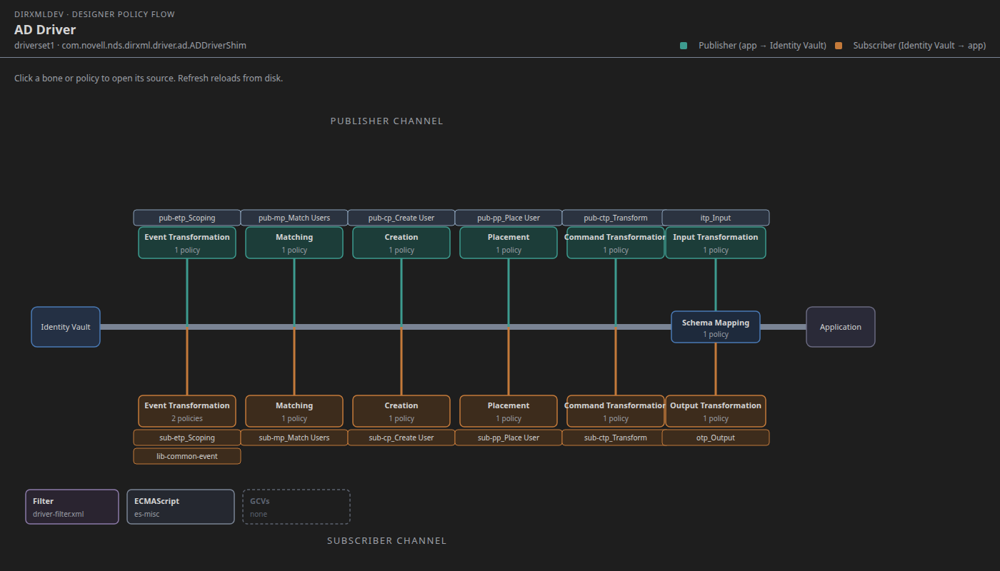

# DirXMLDev Visual

Thin VS Code / Cursor extension: the classic Designer **policy-flow fishbone**
for a driver stored as IDM-as-code. Click a bone to open the policy XML.
Refresh reloads from disk after agent edits.

Not a Designer replacement. It does not write the tree, talk to a vault, or
edit on the canvas. Design: [`docs/vscode-extension-v1.md`](../../docs/vscode-extension-v1.md).

## What you see

```
                    Publisher  (application → Identity Vault)
     Event    Matching   Creation   Placement   Command      Input Transformation
       |         |          |           |          |              |
 IDV ============ spine ============ Schema Mapping ======================== App
       |         |          |           |          |              |
     Event    Matching   Creation   Placement   Command      Output Transformation
                    Subscriber (Identity Vault → application)
```

Policy-set **keys** are this repo’s `PolicySet` enum (`subscriber-event`,
`schema-mapping`, …). Labels are Designer’s names (Event Transformation, …).

The bundled smoke driver is `sample-tree/` (`AD Driver`), laid out like
`docs/model.md` (`driverset.xml` + `drivers/AD Driver/driver.xml` linkage):



## Commands

| Command | Id |
|---|---|
| **DirXMLDev: Show Policy Flow (Fishbone)** | `dirxmldev.fishbone.show` |
| **DirXMLDev: Reveal Fishbone Node Source** | `dirxmldev.fishbone.reveal` |
| **DirXMLDev: Refresh Fishbone from Disk** | `dirxmldev.fishbone.refresh` |

Show uses the driver of the active editor when that file sits under a
`drivers/<name>/` tree, otherwise Quick Pick. Reveal opens the last clicked
node. Refresh re-reads manifests; so does saving `driver.xml` / `*.policy.xml`,
or touching `.dirxmldev/fishbone.refresh`.

## Install / F5

Needs Node 18+ (22 is fine) **and a built DirXMLDev checkout**: since 0.1.2 the
extension draws what `bin/idm query <tree> fishbone <driver> --json` returns and
parses no manifest itself, so the tree's files have one reader (the Java model).
The launcher is found from the `dirxmldev.idmPath` setting, `IDM_HOME`, a
`bin/idm` above the tree or a workspace folder, or `idm` on the PATH; a tree
outside the checkout needs one of the first two.

### VS Code — debug (F5)

```bash
cd extensions/dirxmldev-visual
npm install
npm test          # fishbone JSON via bin/idm + SVG labels against sample-tree
```

Open **this folder** (`extensions/dirxmldev-visual`) in VS Code, press **F5**.
The launch config starts an Extension Development Host with `sample-tree` as
the workspace.

1. Command Palette → **DirXMLDev: Show Policy Flow (Fishbone)**
2. The fishbone opens beside the editor. Click **Event Transformation** on the
   Subscriber (bottom) rib, or the `sub-etp_Scoping` chip — the policy XML
   opens.
3. Command Palette → **DirXMLDev: Reveal Fishbone Node Source** (same file if
   that node is still selected).
4. Edit `drivers/AD Driver/subscriber/sub-etp_Scoping.policy.xml` (add a
   comment) or `driver.xml`, then **DirXMLDev: Refresh Fishbone from Disk**.
   The diagram reloads; the policy file on disk is what you just saved.

### Cursor

Same compile, then either:

- **F5** if the Cursor window is this folder (Extension Development Host), or
- Install the folder as a local extension:

```bash
cd extensions/dirxmldev-visual && npm install && npm run compile
# Cursor: copy or symlink this directory into ~/.cursor/extensions/pointblue.dirxmldev-visual-0.1.1
# VS Code: ~/.vscode/extensions/…
ln -s "$(pwd)" ~/.cursor/extensions/pointblue.dirxmldev-visual-0.1.1
```

Restart Cursor, open `sample-tree` (or any repo with a `driverset.xml`), run
**DirXMLDev: Show Policy Flow (Fishbone)**.

From a vsix (optional):

```bash
npx --yes @vscode/vsce package --no-dependencies
# then: Cursor / VS Code → Install from VSIX
```

### Open a real tree

Any IDM-as-code root (`driverset.xml`) works — a client `tree/` from
`bin/idm import` / `import-live` / `import-project`. Open that folder (or a
parent workspace); Show finds `**/driverset.xml`. Designer `.project` folders
activate the extension but are not parsed in v1 — import them first.

## Smoke path (also what CI/`npm test` covers)

From `extensions/dirxmldev-visual` after `npm run compile`:

```bash
node out/cli.js dump sample-tree "AD Driver"
# JSON: publisher/subscriber ribs, schema-mapping/input/output on the spine,
# files relative to the tree. Click path = those files.
```

Manual UI (F5 / installed):

1. Show Policy Flow → fishbone for **AD Driver** with both channels populated.
2. Click `sub-etp_Scoping` → editor opens
   `drivers/AD Driver/subscriber/sub-etp_Scoping.policy.xml`.
3. Click Subscriber **Event Transformation** bone → Quick Pick if more than one
   policy (this sample has `sub-etp_Scoping` and library `lib-common-event`).
4. Refresh from Disk → hint “Reloaded from disk.”
5. Agent hook without the command:

```bash
mkdir -p sample-tree/.dirxmldev
date -Iseconds > sample-tree/.dirxmldev/fishbone.refresh
```

`.dirxmldev/` is local; do not commit it.

## MCP / harness hooks

No MCP server in DirXMLDev (CLI-only). Tool stubs:
[`mcp/tools.json`](mcp/tools.json) — `fishbone.get` / `refresh` / `reveal`.
TypeScript: `src/hooks.ts`. After an agent edits policies, `fishbone.refresh`
(sentinel or the VS Code command) is the only visualization write it needs.
Proposed later CLI: `bin/idm query <tree> fishbone <driver> --json` (same JSON).
